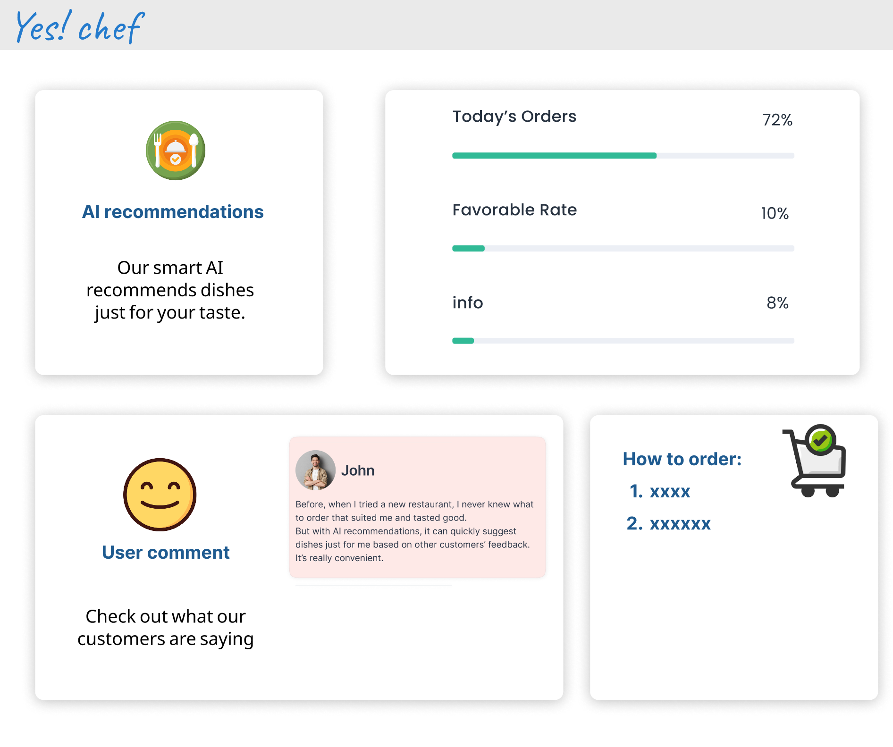
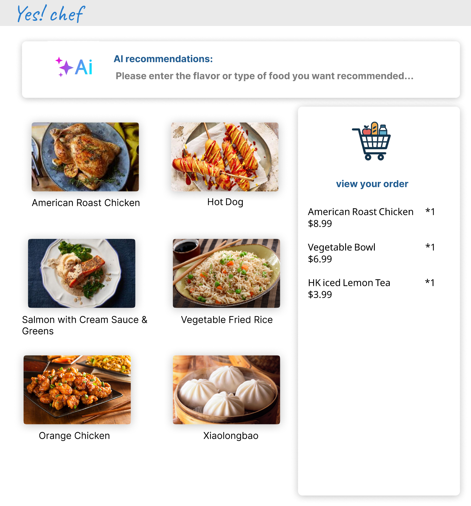

# Yes! Chef – AI Online Ordering System (UI Prototype)

This project presents the UI prototype design of an AI-powered online food ordering system called **“Yes! Chef”**.  
The design emphasizes simplicity, usability, and intelligent recommendation to enhance the overall user experience.

---

## 1. Sign Up Page

### Description

This page presents a simple and clean login and registration interface.  
Users can quickly create an account using their email address.

By registering, users can access membership benefits, promotional offers, and other exclusive features provided by the restaurant.  
The layout is intentionally minimal to ensure clarity and ease of use.

---

## 2. AI Information & System Overview Page

### Description

This page provides an overview of the AI-powered ordering system.  

It displays key information such as user feedback, favorable rate statistics, order data, and general system indicators.  
These elements help users understand the functionality of the AI system and increase trust in its recommendations.

In addition, brief instructions are included to guide users on how to use the application effectively.

---

## 3. Ordering Page

### Description

This page represents the main ordering interface of the application.  

An AI recommendation section is available, allowing users to choose whether to receive AI-suggested dishes based on preference data and feedback analysis.  
Users may also browse the menu independently and select items freely.

The shopping cart updates in real time, clearly displaying selected items and quantities.  
This allows users to monitor their order before proceeding to checkout.

---

## Project Scope & Status

This prototype focuses specifically on the **individual user interface** of the system.  

A separate merchant-side interface will be designed and developed in a later phase of the project.

At this stage, the personal user interface remains in the **draft prototype phase**, and further refinements and feature improvements are planned.

---
